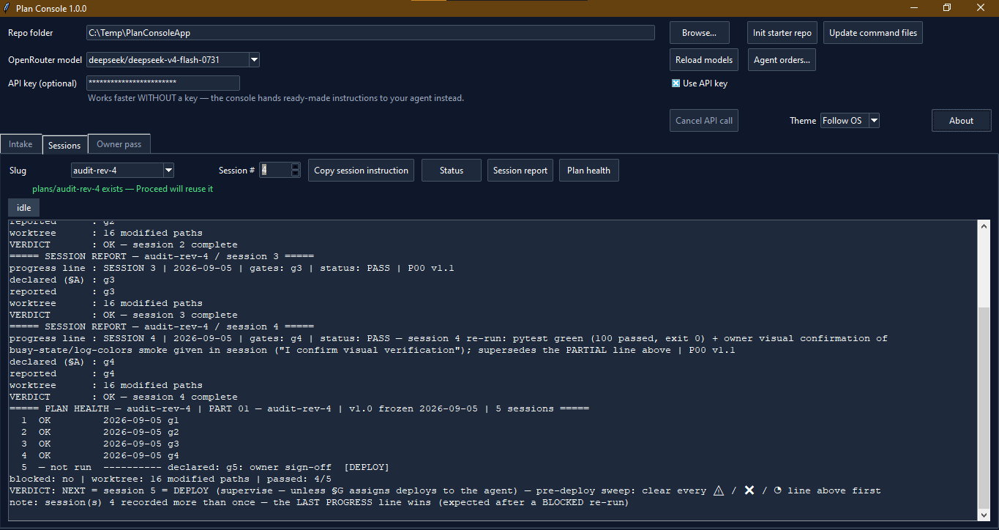

# Plan Console

[](LICENSE)
[](https://www.python.org/)
[](#requirements)
[](https://buymeacoffee.com/costeliordan)

**Plan Console** turns a pasted plan, brainstorm, or audit report into a structured, validated, "frozen" project plan (`PART-01 v1.0.md`) inside any target repo — and then manages the day-to-day loop of executing that plan through an external coding agent such as Claude Code, Cursor, Codex, or any other agent-agnostic workflow.

It is built for **solo developers and small teams driving AI coding agents**. You stay the owner of the work: answer open questions, tick reconnaissance items, gate the freeze, run copy-paste sessions with standing orders, and track progress and health. The result is that ad-hoc AI-coding chaos becomes a disciplined **plan → owner pass → freeze → session** lifecycle with hard gates, machine-parseable progress records, and a complete audit trail (`HEALTH.md`) — all in a zero-dependency, offline desktop application.

> **What's new in 1.0.0:** the first public release — a single-file, stdlib-only Tkinter app with the complete intake → owner pass → freeze → session lifecycle, bundled sample project, and a 100-test regression suite.

<p align="center">
  
</p>

*PlanConsoleApp in action — the interactive console for turning a pasted plan into a frozen, validated project plan.*

## Features

- **Zero pip dependencies** — pure Python standard library (Tkinter included); no `pip install` required.
- **Fully offline** — everything runs on your machine. The only network use is the *optional* OpenRouter integration.
- **Works without an API key** — instead of calling an API, the console produces copy-paste instructions for your own coding agent. See [`no-api-key-guide.html`](no-api-key-guide.html).
- **Privacy-first** — an API key is never persisted; it lives only in the entry field for the current session (or in an environment variable).
- **Agent-agnostic** — plan and command files work with any agent that can read a markdown rulebook; you are never locked to one vendor.
- **Hard freeze gates** — a plan cannot be frozen until zero open questions, zero unchecked recon items, zero unchecked owner actions, and a passing validation remain.
- **Machine-parseable progress** — `PROGRESS.md`, `HEALTH.md`, and status parsing are lenient but auditable; drift is flagged, not hidden.
- **Cross-platform** — Windows, macOS, and Linux on Python 3.9+.

## How it works

The lifecycle enforced by the console:

1. **Intake** — paste a plan/brainstorm/audit report; the console writes `plans/<slug>/SOURCE.md` and either calls OpenRouter (if you opt in) or generates a ready-made instruction for your agent.
2. **Owner pass** — answer open questions (structured `PROBLEM`/`QUESTION`/`RECOMMEND` blocks), tick recon checklist items, and run owner-only actions; every answer is archived, nothing is lost.
3. **Validate** — the agent's draft (`PART-01.draft.md`) is checked against validation rules before it may be frozen.
4. **Freeze** — once all gates pass, the plan is stamped as `PART-01 v1.0.md` and becomes the single source of truth for execution.
5. **Sessions** — run copy-paste sessions with standing orders from `AGENT-ORDERS.md`; Status / Session report / Plan health parse `PROGRESS.md` leniently and flag drift.

For the full picture — including the first-run license gate and every tab — see [`UserGuide.html`](UserGuide.html).

## Codebase map

```
.
├── plan-console.py            # The entire application: Tkinter UI (Intake / Owner
│                              #   pass / Sessions tabs), parsers, OpenRouter client,
│                              #   theme system, splash + license gate + About dialog
├── plan.bat                   # Windows launcher (tries `py`, then verified python;
│                              #   handles the Microsoft Store python stub)
├── PART-00.md                 # Universal session-protocol rulebook deployed into
│                              #   every target repo
├── AGENT-ORDERS.md            # Standing orders prepended to session instructions
├── commands/                  # The 7 agent command files (new-plan, recon,
│                              #   owner-resolve, validate-plan, freeze-plan,
│                              #   session, plan-status); also embedded as
│                              #   STARTER_FILES in plan-console.py (source of truth)
├── templates/                 # templates/PART-01.md — blank plan form (sections A–G)
├── samples/
│   └── demo-project/          # Bundled example project, copied to a folder of your
│       ├── plans/demo-recipe-cli/     #   choice via "Open sample project…"
│       └── plans/demo-journal-wip/    #   (finished end-state / mid-workflow demos)
├── test/                      # pytest suite: test_parsers.py (parser/guard tests)
│                              #   and test_theme.py (theme-system tests)
├── assets/                    # console.css + theme.js — shared offline styling
│                              #   for the HTML guides
├── UserGuide.html             # Deep 13-section user guide (styled; links assets/)
├── UserGuide.txt              # Plain-text twin of the user guide
├── no-api-key-guide.html      # Comprehensive guide for working without an API key
├── LICENSE                    # Apache License, Version 2.0
├── NOTICE                     # Apache 2.0 NOTICE file
└── plan-console.json          # Per-user settings (gitignored; created next to the
                               #   script on first run)
```

Starter files (`PART-00.md`, `templates/`, `commands/`) are deployed into each *target* repo by the **Init starter repo** button; **Update command files** refreshes existing repos in place.

## Requirements

- **Python 3.9 or later** with Tkinter (included in the standard python.org installers; on Windows, tick *tcl/tk and IDLE* if customizing).

Check your version:

```bash
python3 --version    # Windows: py --version
```

## Installation

No package installation is needed — the app is a single script.

**Windows:** double-click [`plan.bat`](plan.bat). It tries `py` first, falls back to a verified `python`, and handles the Microsoft Store python stub.

**macOS / Linux:**

```bash
python3 plan-console.py
```

**First run:** a splash screen appears, then you are asked to accept both the full Apache 2.0 license text and the as-is disclaimer by ticking two separate agreement checkboxes (the **I Agree** button unlocks only when both are ticked; acceptance is persisted in `plan-console.json`, so it is asked only once). Afterwards the main window opens, maximized; the **About** button shows the app name, version, copyright, and license.

## Quick start

1. Clone this repository and launch the app (see [Installation](#installation)).
2. Click **Open sample project…** and pick an empty folder to explore the bundled worked example.
3. Or point **Repo folder** at your own project and click **Init starter repo** (creates `PART-00.md`, `templates/`, `commands/` in the target repo).
4. Paste your plan or brainstorm on the **Intake** tab and generate a plan draft.
5. Work the **Owner pass** tab until all gates are green, then **Freeze** the plan and start running **Sessions**.

The 13-section [`UserGuide.html`](UserGuide.html) is the definitive walkthrough; [`samples/demo-project/README.md`](samples/demo-project/README.md) explains the bundled examples in detail.

## Documentation

| Document | Purpose |
|---|---|
| [`UserGuide.html`](UserGuide.html) / [`UserGuide.txt`](UserGuide.txt) | Deep 13-section user guide (HTML twin links `assets/`) |
| [`no-api-key-guide.html`](no-api-key-guide.html) | Comprehensive guide for working without an API key |
| [`samples/demo-project/README.md`](samples/demo-project/README.md) | The bundled example project: `demo-recipe-cli` (finished) and `demo-journal-wip` (mid-workflow) |
| [`PART-00.md`](PART-00.md) | The universal session-protocol rulebook deployed into target repos |
| [`templates/PART-01.md`](templates/PART-01.md) | The blank plan form (sections A–G) |

## Tests

```bash
py -m pytest test/ -q    # or: python3 -m pytest test/ -q
```

- [`test/test_parsers.py`](test/test_parsers.py) — parser and guard regression tests (question blocks, lenient `PROGRESS.md` parsing, recon checkbox rules, the `<<<FILE>>>` path guard, owner-action parsing, the read-only command whitelist).
- [`test/test_theme.py`](test/test_theme.py) — theme-system tests (`THEMES` completeness, hex validity, OS-theme detection fallbacks).

The suite contains 100 tests, all passing; Tk-dependent tests skip automatically on headless machines. No network or repo access is required.

## Security and privacy

- The OpenRouter API key is **never persisted** — it lives in the entry field for the current session only, or in the `OPENROUTER_API_KEY` environment variable. `plan-console.json` is gitignored.
- In API mode, the console inlines repo files into prompts, so **data leaves your machine** via OpenRouter. Without a key, nothing is sent anywhere — instructions are copied for your own agent to run locally.
- Model-produced files are only ever written inside `plans/<slug>/` of the target repo (enforced by a path guard covered by unit tests).

## Sponsor this project

If Plan Console saves you time, please consider [buying me a coffee](https://buymeacoffee.com/costeliordan). You can also use GitHub's native **Sponsor this project** button once the funding configuration is enabled — see [`.github/FUNDING.yml`](.github/FUNDING.yml).

## License

Licensed under the [Apache License, Version 2.0](LICENSE). See the [NOTICE](NOTICE) file for attribution details.

Copyright © Costel Iordan (costel.iordan@gmail.com)

## Acknowledgments

- The app is built entirely on the Python standard library — thanks to the Python and Tkinter communities.
- Thanks to the maintainers of the coding agents this workflow is designed around: Claude Code, Cursor, Codex, and friends.

## Support

If **Plan Console** has saved you time or prevented AI agent drift, please consider [buying me a coffee](https://buymeacoffee.com/costeliordan) to support continuous compatibility updates!
